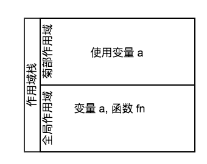

从3月底开始, 我一直都在面试, 经常被问到闭包的问题, 并且在我写 [Lisp 解释器](https://github.com/ChauMing/Lisp-Evaluator.git)的时候, 从一个语言设计者的角度实现了闭包. 所以本文不着重于说什么是闭包和如何使用闭包, 而是说闭包为什么会出现, 闭包是如何实现的.

#### 由来与解释

闭包这个数据来自离散数学, 在离散数学中, **如果将一个运算应用于一个集合的元素, 产生的结果仍然是该集合本身, 那么称这个集合在某个运算下是闭包的.** 举个🌰, 将"+"这个操作应用于整数集合, 得到的还是整数集合, 我们称整数集合在"+"这个操作下是闭包.

由 [wiki](https://zh.wikipedia.org/wiki/%E9%97%AD%E5%8C%85_(%E8%AE%A1%E7%AE%97%E6%9C%BA%E7%A7%91%E5%AD%A6))上看来, 在编程语言领域, clourse 这个说法是由 P.J. Landin 发明的, **在这里的闭包指的是词法闭包, 是编程语言的特性, 是与所处的环境绑定在一起的函数.**

在 SICP 这本书2.2层次性数据和闭包性质这一节里, 作者在注解里提到:

> 术语"闭包"来自抽象代数, 抽象代数里, 一集元素称为在某个运算下封闭, 如果该运算应用于这一集合众的元素, 产生出来的仍然是该集合的元素. **然而 Lisp 社团(很不幸)还用术语"闭包"描述另一个毫不相干的概念: 闭包也是一种为表示带有自由变量的过程而用的实现结束.**

~~作者用了不幸两个字, 我认为还是有一定道理的~~

#### 词法&环境?

在上面的解释中, 提到两个关键字, 一个是词法, 一个是环境. 我来解释一下这两个词的意思.

###### 环境

先简单来说说环境是什么, **环境就是作用域**. 

**想一想如果我们作为Lisp, JS的设计者, 我们该如何设计作用域?**

我们可以很自然的想到用栈去设计这两门编程语言的作用域:

------------

首先创建一个全局作用域, 在全局作用域声明的变量和函数都会放在这个作用域里面. 当一个函数被运行的时候,  在全局作用域之上, 压入一个新的环境, 作为这个函数的作用域, 如果这个函数使用了一个外部作用域的变量, 那么, 我们就一层一层的往栈的下方找. 

如图, 如果我们在全局环境下调用了一个函数fn,  fn 使用了外部变量 a, 那么在 fn 这个菊部作用域中, 我们没有找到这个变量 a, 就该沿着作用域栈往下一层一层地找, 直到找到变量 a 为止. 

函数运行结束以后, 将这个栈(菊部作用域)退出来销毁, 作用域栈中只保留全局作用域.

-----------

环境我们先说到这里. 再说说词法.


###### 词法

词法在这里的意思是词法作用域(静态作用域).

###### 词法作用域

**词法作用域是函数的作用域是它声明时的作用域**

与之相对的是动态作用域, 在动态作用域的语言中,  函数调用时的作用域是他被调用时的作用域.

有点绕, 再举个栗子: 

```JavaScript
let v = 1;
function globalFnCallInLocal() {
  console.log(v);
}
(function(){
  let v = 2;
  globalFnCallInLocal();
}());
```

在上面这段代码里,  `globalFnCallInLocal`这个函数调用时, 输入的v 是全局作用域的 v 也就是 2, 也就是说, 这个函数的调用栈和他声明的位置相关, 而与它运行的位置无关, 所以这是词法作用域.  

如果输入的变量是局部变量, 也就是2那么这个函数的栈是在自执行函数栈之上的, 这样的话就是动态作用域了. 

动态作用域是很操蛋的, 所以据我所知只有 shell 是动态作用域的. 

**题外话 : **

> 动态作用域因为有很多不确定性,  在 JavaScript 中, this 是指向和动态作用域类似, 它们与函数被调用的环境或被哪个对象调用有关, 所以新手总是莫名其妙得陷入找不到 this 的尴尬之中. 如果作用域动态实现就经常找不到或者找到错误的外部变量了, 那不是更操蛋????


#### 一等公民函数

一等公民函数这个函数式编程的概念其实很简单: 可以像对待任何其他数据类型一样对待它们——把它们赋值给变量, 当作参数传递, 做为返回值返回… 等等.


#### 闭包是一等公民函数和词法作用域结合的自然结果

因为由以上几个概念, 我们可以得出一个结论:  **闭包是支持词法作用域和一等公民函数的必然结果**, 也就是说: JS 和 Lisp这类可以直接引用外部作用域的变量的编程语言, 他们支持词法作用域, 他们的函数是一等公民, 那么它们支持闭包.

为什么这样说呢?

再看一个🌰: 

```JavaScript
var v = 2;
var fn = (function() {
  var v = 1;
  return function() {
     return v;
  }
}());
```

上面的代码是再普通不过的闭包了.


自执行函数返回了一个函数赋值给 fn,这都体现了 JS 中一等公民函数的特性.

又由于 JS 是使用词法作用域的, 那么 fn 的作用域栈应该与它声明的位置有关:

fn 调用时的作用域栈应该是这样的: 


当 fn 使用变量 v 时, 应该从作用域栈往下找, 找到自执行函数作用域中的 v.

所以又以上两点原因, fn 调用时, 使用 v 得到的必须是 1而不是2.

#### 那么如何实现闭包

之前我谈到环境的时候简单地说了一下函数调用时将环境做为一个栈, 当函数调用结束以后, 把栈销毁. 

但是这样设计的函数调用栈是有问题的, 因为他没有办法实现闭包.那么怎么做才能实现闭包呢?

很简单: **函数被声明时把函数本身和它声明的环境绑定在一起, 当函数被调用时, 把函数放在与他绑定的环境上运行, 并且函数结束调用时, 不销毁它的作用域栈.**

这样其实也就回到了最开始时对闭包的解释. 闭包是函数与作用域的绑定.

但是出于对性能的考虑, 函数调用结束后, 可以选择性的销毁它的作用域栈, 例如一个函数内部没有任何函数声明时, 我们还是可以销毁它的作用域.

所以在不必要的情况下, 出于对性能的考虑, 不要在函数内部声明函数.


**声明: 以上对于作用域栈和闭包的设计仅代表的个人思考所得的观点和在写 [Lisp 解释器](所得的观点)时的具体实现, 不代表 JS或者 Lisp 的具体实现, 如果有什么错误, 欢迎指出**

### 参考

[MDN 闭包](https://developer.mozilla.org/zh-CN/docs/Web/JavaScript/Closures)


